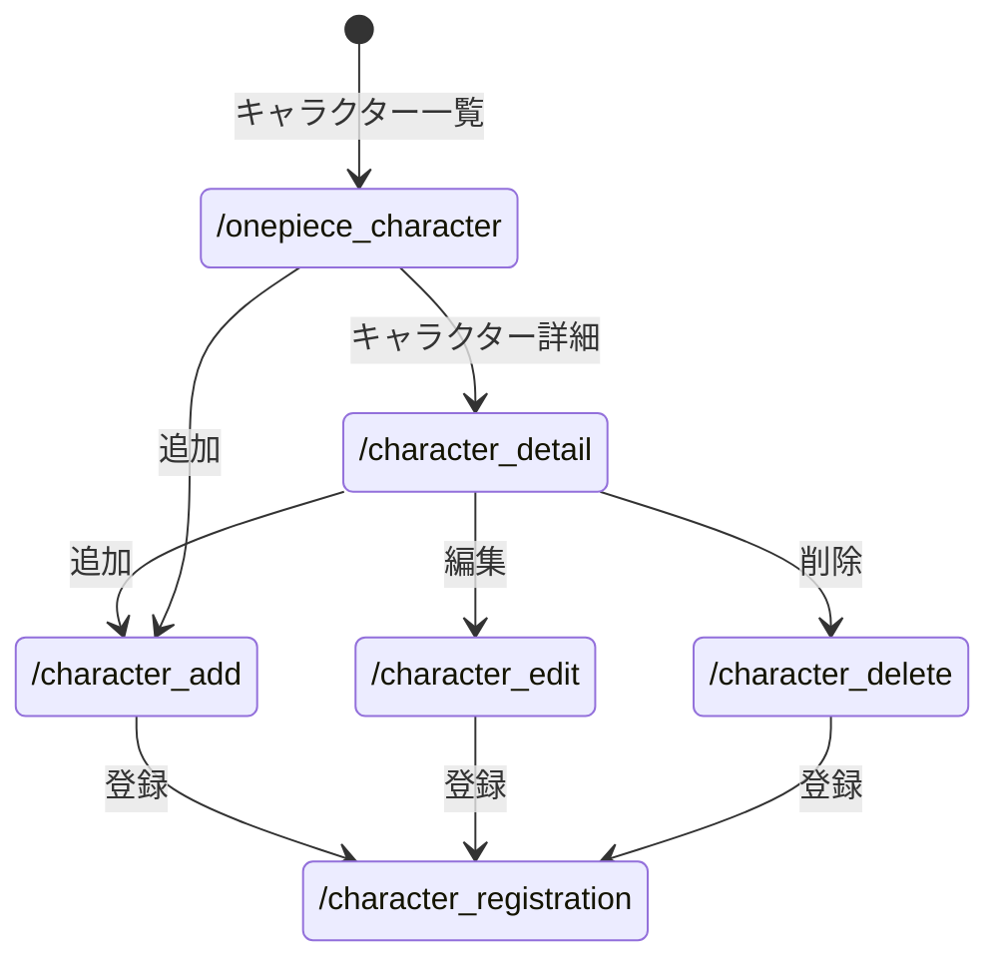

# 開発者向け仕様書

## ワンピースキャラクター管理システム

### 概要
本ドキュメントは開発したワンピースキャラクター管理システムのWeb設計とデータ構造を定義し，第三者による開発を可能にすることを目的とする．

### ページ遷移図

### データ構造
項目名 | 型 | 内容
-|-|-
character_id|数値|キャラクターを識別するid
name|文字列|キャラクター名
devil_fruit|文字列|悪魔の実
bounty|数値|最新の懸賞金（ベリー）
affiliation|文字列|所属組織

### HTTPメソッドとリソース名一覧

HTTPメソッド|リソース名|機能
-|-|-
GET|/onepiece_character|キャラクター一覧を取得・表示
GET|/character_detail|キャラクターの詳細を表示
POST|/character_add|新しいキャラクターデータを登録する
POST|/character_edit|キャラクターの編集
POST|/character_delete|キャラクターの削除
POST|/character_registration|キャラクターの登録後表示

