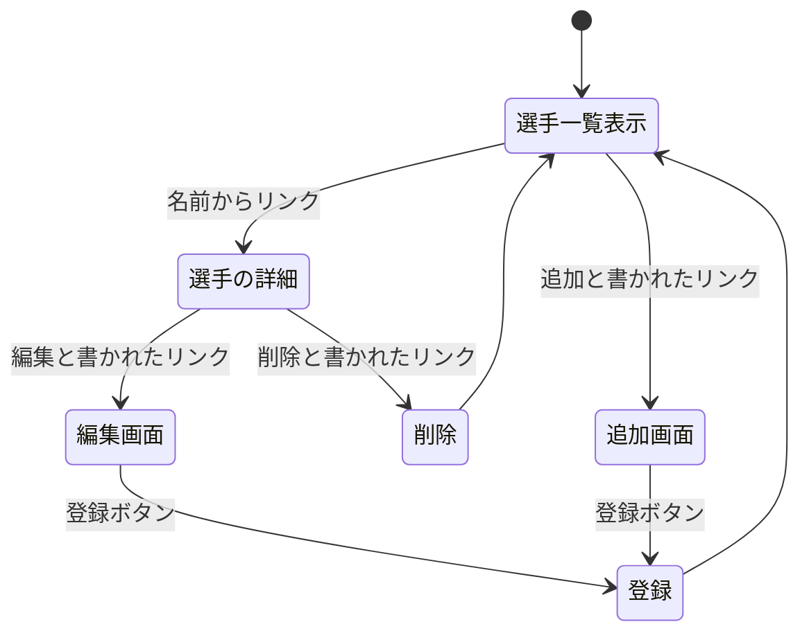

# 開発者向け仕様書

## サッカー選手管理システム

### 概要
本ドキュメントは開発したサッカー選手管理システムのWeb設計とデータ構造を定義し，第三者による開発を可能にすることを目的とする．

### ページ遷移図

### データ構造
項目名 | 型 | 内容
-|-|-
id|数値|選手を識別するid
name|文字列|選手の名前
position|文字列|担当するポジション
market_value|文字列|市場価値（万ユーロ）
club|文字列|所属クラブチーム

### HTTPメソッドとリソース名一覧

HTTPメソッド|リソース名
-|-
GET|/soccer
GET|/detail/:number
GET|/create
POST|/create
GET|/edit/:number
POST|/update/:number
GET|/delete/:number

### リソース名ごとの機能の詳細
#### /soccer
機能としては，まず，player配列に格納されているすべてのデータを読み込む．次に，読み込んだデータをループ処理し，各選手のID（id）と名前（name）をリスト形式で画面に表示する．また，各選手名には詳細画面（GET/detail/:number）へのハイパーリンクを設定する．画面内には，追加画面（GET/create）への「追加」ハイパーリンクを配置する．さらに，他のリソース（POST/create，GET/delete，POST/update）から呼び出された際，引数として渡されたmessage変数の内容を画面上部に緑色の強調テキストで表示する．

#### /detail/:number
機能としては，まず，URLパラメータから取得したnumberを基に，player配列から該当するオブジェクトを取得する．取得したオブジェクトから名前（name），ポジション（position），市場価値（market_value），所属クラブチーム（club）をテーブル形式で画面に表示する．取得したnumberをidx変数として渡し，編集画面（GET/edit/:number），削除処理（GET/delete/:number），一覧表示（GET/soccer）へのハイパーリンクを配置する．この画面は一覧表示画面（GET/soccer）の選手名のハイパーリンクをクリックすることで遷移し表示される．

#### GET/create
機能としては，まず，新規選手のデータを入力するための画面を表示する．この画面は，一覧表示画面（GET /soccer）に配置された「追加」ハイパーリンクをクリックすることで遷移し表示される．表示内容としては，名前（name），ポジション（position），市場価値（market_value），所属クラブチーム（club）を入力するためのテキストボックスを持つ画面を表示する．この画面の「登録」ボタンをクリックすることで，データ登録処理（POST/create）へリクエストを送信する仕組みとなっている．また，登録を行わずに一覧表示画面（GET /soccer）へ戻るためのハイパーリンクを配置する．

#### POST/create
機能としては，まず，追加画面（GET/create）から送信された各データ（名前，ポジション，市場価値，所属クラブチーム）を取得する．次に，現在のplayer配列の要素数に基づいて新しいID（id）を生成し，取得したデータと共に一つのオブジェクトとして配列の末尾に追加する．処理終了後は，一覧表示画面（GET/soccer）を再描画し，その際に「新しく登録しました！」というメッセージを引数として渡すことで，画面上部に処理結果を強調表示する．

#### /edit/:number
機能としては，まず，URLパラメータから取得したnumberを基に，player配列から修正対象のオブジェクトを取得する．次に，取得したデータをdata，numberをidxとして渡す．表示内容としては，名前（name），ポジション（position），市場価値（market_value），所属クラブチーム（club）の各入力項目に対し，value属性を用いて現在の登録内容を初期値としてセットした状態で画面に表示する．この画面の「登録」ボタンをクリックすることで，更新処理（POST/update/:number）へリクエストを送信する．また，修正を行わずに一覧表示画面（GET /soccer）へ戻るためのハイパーリンクを配置する．

#### /update/:number
機能としては，まず，編集画面（GET /edit/:number）から送信された更新後のデータを受け取る．次に，URLパラメータから取得したnumberを基に，player配列内の該当するオブジェクトを参照し，各データ（名前，ポジション，市場価値，所属クラブチーム）の内容を新しい値で上書き（更新）する．処理終了後は，一覧表示画面（GET/soccer）を再描画し，その際に「編集しました！」というメッセージを引数として渡すことで，画面上部に処理結果を強調表示する．

#### /delete/:number
機能としては，まず，詳細画面（GET/detail/:number）に配置された「削除」ハイパーリンクをクリックすることで，URLパラメータから削除対象のインデックス番号を取得する．次に，取得した番号を基にplayer配列から該当する要素を1件削除する．処理終了後は，一覧表示画面（GET/soccer）を再描画し，その際に「削除しました！」というメッセージを引数として渡すことで，画面上部に処理結果を強調表示する．

