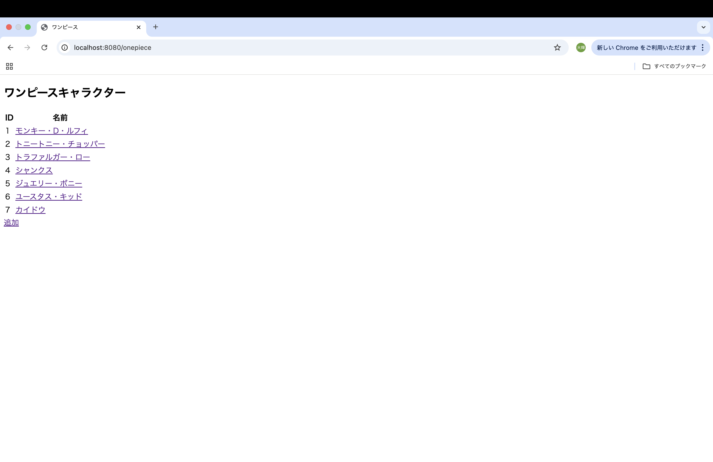
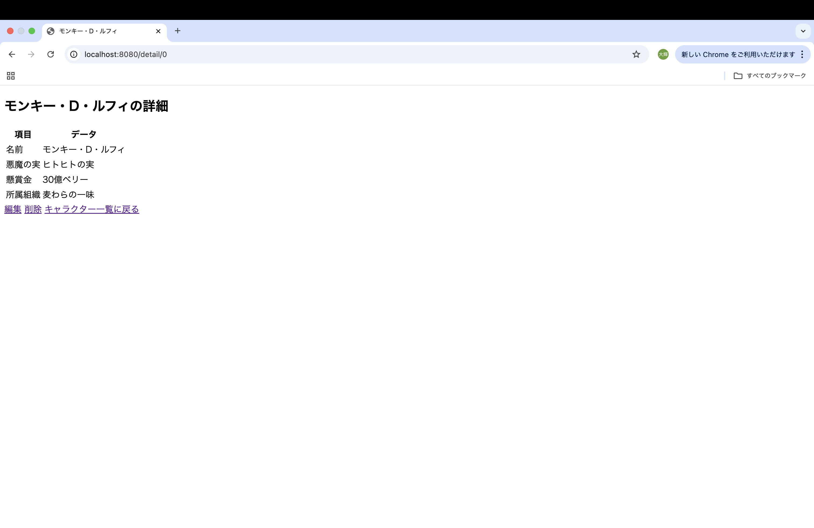
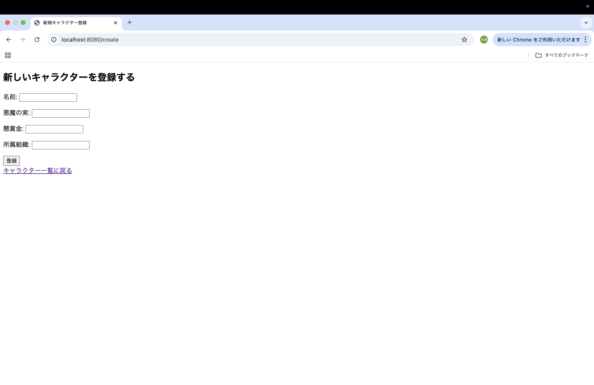

# 利用者向け仕様書（ワンピースキャラクター管理システム）

## 概要
本システムは，お気に入りのワンピースキャラクターの情報を登録し，一覧として管理するためのツールである．キャラクターの名前，悪魔の実，懸賞金，所属組織を自由に追加・編集・削除することができる．

## 使用できる機能

機能|内容
-|-
一覧表示|登録されているキャラクターをリスト形式で確認できる
詳細表示|キャラクターの詳しい情報を個別に閲覧できる
データ追加|/新しいキャラクターをシステムに登録できる
データ編集|すでに登録されている情報を書き換えることができる
データの削除|不要になったキャラクターの情報を削除できる

## 操作マニュアル

### 起動画面（キャラクター一覧）

ブラウザを起動し，「http://localhost:8080/onepiece」を入力すると最初に図1の画面が表示される．表の見方としては，登録されたキャラクターのIDと名前が並んでいる．また，キャラクターの名前をクリックするとそのキャラクターの詳細画面へ移動する．さらに，追加と書かれたリンクをクリックすると登録画面へ移動する．

### 詳細表示

図2は一覧画面で名前をクリックすると表示される画面である．ここでは，名前や悪魔の実，懸賞金，所属組織の情報を確認できる．編集と書かれたリンクをクリックすると情報を書き換える画面へ進む．また，削除と書かれたリンクをクリックするとこのデータが削除され，一覧画面に戻る．さらに，間違えてこの画面を開いた場合は，キャラクター一覧に戻ると書かれたリンクで戻ることができる．

### データ追加

図3は一覧画面で追加と書かれたリンクをクリックすると表示される画面である．ここでは，名前と悪魔の実，懸賞金，所属組織をそれぞれボックスに入力する．入力後，登録ボタンをクリックすると一覧画面に新しいキャラクターが追加される．間違えてこの画面を開いた場合は，キャラクター一覧に戻ると書かれたリンクで戻ることができる．

### データ編集

図4は詳細画面の編集と書かれたリンクをクリックすることで表示される画面である．ここには，現在登録されている内容が入力ボックスに入った状態で表示される．そして，修正したい箇所を書き換え，登録ボタンをクリックすることで内容が更新され，一覧画面に戻る．間違えてこの画面を開いた場合は，キャラクター一覧に戻ると書かれたリンクで戻ることができる．

## 便利な機能
追加・編集・削除が成功すると一覧画面の上部に「新しく登録しました！」などのメッセージが緑色の文字で表示される．これにより，操作が正しく完了したことを確認できる．
